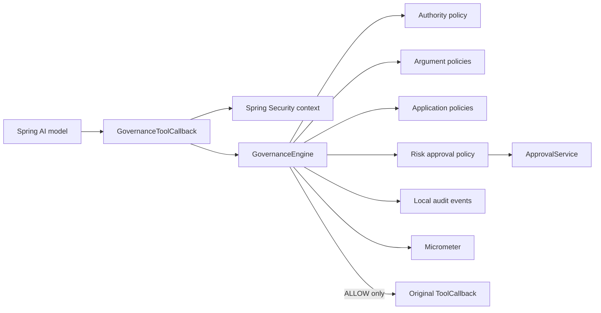
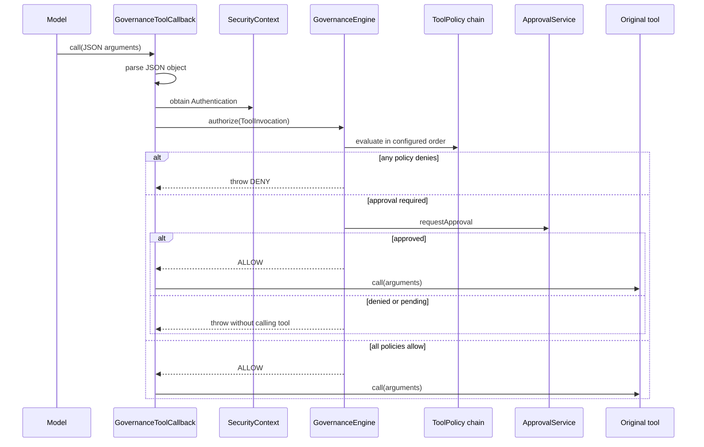

# Spring AI Governance

Spring-native authorization, policy, approval, audit, and metrics enforcement for Spring AI tool execution.

## Problem Statement

An AI model may choose a valid tool call that the current application user is not allowed to perform. Tool schemas alone cannot enforce identity, tenant boundaries, business constraints, human approval, or audit requirements. Those checks must run immediately before the side effect and must use the application security context.

## What This Project Solves

Spring AI Governance wraps `ToolCallback` instances with a fail-closed enforcement boundary. Each invocation is parsed, associated with the current Spring Security `Authentication`, and evaluated against required authorities, typed argument rules, application policies, and risk-based approval rules. Only an `ALLOW` result reaches the original callback.

The library provides:

- `@GovernedTool` metadata for risk and required authorities
- `ALLOW`, `DENY`, and `REQUIRE_APPROVAL` decisions
- Spring Security `AuthorizationManager` integration
- required-field, regex, and numeric-range argument rules
- a synchronous approval SPI with deny-by-default behavior
- local Spring application audit events without argument payloads
- Micrometer decision counters
- adapters for Spring AI callback providers and MCP-originated callbacks
- deterministic tests with fake tools and principals

## When To Use It

Use this library when a Spring AI agent can invoke tools that read protected data or create side effects. It is especially useful for payment, account, infrastructure, support, and administrative tools where model selection must never substitute for application authorization.

Do not use it as an identity provider. Authentication remains the responsibility of Spring Security and the application's configured identity system.

## Architecture / HLD



The wrapper is the security boundary. Applications pass the wrapped callback to `ChatClient` or expose it through their selected Spring AI integration. Keeping the original callback out of the model-visible registry prevents accidental bypass.

## Detailed Design / LLD



`DENY` takes precedence. If no policy denies and at least one requires approval, the approval service decides whether the current invocation can proceed. `PENDING` remains non-executable; a caller must retry through an application-specific flow after approval is recorded.

Audit events contain the invocation ID, tool name, principal name, risk, decision, policy, reason, and timestamp. Raw arguments are deliberately excluded.

## Public API / API Structure

| Package | Primary types | Responsibility |
| --- | --- | --- |
| `governance` | `GovernedTool`, `ToolDescriptor`, `ToolInvocation`, `ToolPolicy`, `GovernanceEngine` | Typed governance model and evaluation |
| `governance.policy` | `RequiredAuthorityPolicy`, `ArgumentPolicy`, `RiskApprovalPolicy`, `SpringAuthorizationPolicy` | Built-in policy implementations |
| `governance.rule` | `RequiredFieldRule`, `RegexFieldRule`, `NumericRangeRule` | Reusable JSON argument constraints |
| `governance.approval` | `ApprovalService`, `ApprovalRequest`, `ApprovalStatus` | Application-owned approval integration |
| `governance.audit` | `GovernanceAuditEvent`, `GovernanceAuditPublisher` | Local audit publication |
| `governance.spring` | `GovernanceToolCallbackFactory`, `GovernanceToolCallbackProvider` | Spring AI callback decoration |
| `governance.mcp` | `McpToolGovernanceAdapter` | Decoration of MCP-originated Spring AI callbacks |

## Core Concepts

### Tool metadata

Metadata can be declared on the application method and converted to a descriptor:

```java
@GovernedTool(
    value = "transfer",
    risk = RiskLevel.HIGH,
    authorities = "payments:write")
public Receipt transfer(String account, BigDecimal amount) {
    // application service
}

ToolDescriptor descriptor = ToolDescriptor.from(
    PaymentTools.class.getMethod("transfer", String.class, BigDecimal.class));
```

Argument rules are attached programmatically so they can use application configuration:

```java
ToolDescriptor governed = descriptor.withArgumentRules(
    new RequiredFieldRule("account"),
    new NumericRangeRule("amount", 0.01, 10_000));
```

### Application authorization

Required authorities are checked by default. For richer Spring Security expressions or tenant-aware rules, register a `SpringAuthorizationPolicy` bean backed by an `AuthorizationManager<ToolInvocation>`.

```java
@Bean
ToolPolicy tenantAuthorization(TenantAccessService access) {
    return new SpringAuthorizationPolicy((authentication, invocation) ->
        new AuthorizationDecision(access.mayUse(
            authentication.get(), invocation.tool().name())));
}
```

### Approval

The default `ApprovalService` denies approval-gated calls. Replace it with an application bean. A returned `APPROVED` value applies only to the supplied request; the application is responsible for durable approval records, approver identity, and expiration.

```java
@Bean
ApprovalService approvalService(ApprovalRepository approvals) {
    return request -> approvals.statusFor(request.invocation().id());
}
```

## Local Prerequisites

- JDK 21 or newer
- Git
- No model API key or hosted service is required

The Maven Wrapper downloads Maven 3.9.12 on first use.

## Steps To Run

```bash
git clone https://github.com/aniket-deshkar/spring-ai-governance.git
cd spring-ai-governance
./mvnw verify
```

On Windows:

```powershell
.\mvnw.cmd verify
```

## Configuration

```yaml
spring:
  ai:
    governance:
      enabled: true
      approval-threshold: high
```

| Property | Default | Meaning |
| --- | --- | --- |
| `spring.ai.governance.enabled` | `true` | Enables auto-configuration |
| `spring.ai.governance.approval-threshold` | `HIGH` | Minimum risk that requires approval |

The auto-configuration supplies the engine, secure default approval service, Spring event audit publisher, metrics integration, security-context authentication supplier, and callback factory. Custom `ToolPolicy` beans are inserted before risk approval.

## Usage Examples

Wrap the callback before registering it with Spring AI:

```java
@Bean
ToolCallback governedTransfer(
        ToolCallback transferCallback,
        GovernanceToolCallbackFactory governance) {
    ToolDescriptor descriptor = new ToolDescriptor(
        "transfer",
        RiskLevel.HIGH,
        List.of("payments:write"),
        List.of(new NumericRangeRule("amount", 0.01, 10_000)));
    return governance.wrap(transferCallback, descriptor);
}
```

For a provider:

```java
ToolCallbackProvider governed = new GovernanceToolCallbackProvider(
    originalProvider,
    Map.of("transfer", transferDescriptor),
    governanceFactory);
```

Spring AI MCP client adapters ultimately expose `ToolCallback` instances. Apply `McpToolGovernanceAdapter.wrap(...)` to those callbacks before making them available to the model. Every callback must have an explicit descriptor; missing metadata fails fast.

## Testing

`./mvnw verify` runs unit, negative, boundary, configuration, policy-precedence, audit, metric, and fake-tool acceptance tests. Tests prove that unauthorized, invalid, denied, and pending invocations do not execute the underlying callback.

The CI workflow runs the same command on Java 21 without credentials or paid services.

## Observability

The Micrometer counter `spring.ai.governance.decisions` uses bounded `tool` and `decision` tags. Audit events are published through Spring's local `ApplicationEventPublisher`. Consumers can persist or forward events according to their compliance requirements.

Policy reasons must remain safe for logs. Do not place secrets or raw argument values in reason strings.

## Security

- Register only governed callbacks with the model-facing client or MCP bridge.
- Keep authorization in Spring Security; do not trust model-provided identity fields.
- The library denies high-risk calls when no approval integration is configured.
- Invalid JSON and non-object arguments fail closed.
- Audit events exclude tool arguments by design.
- Custom policies should return generic reasons and avoid sensitive data.
- Report vulnerabilities according to [SECURITY.md](SECURITY.md).

## Repository Structure

```text
src/main/java/io/github/aniketdeshkar/governance/
├── approval/       approval SPI and statuses
├── audit/          local audit event publication
├── autoconfigure/  Spring Boot configuration
├── mcp/            MCP callback adapter
├── policy/         built-in policies
├── rule/           reusable argument rules
└── spring/         Spring AI callback wrappers
src/main/resources/META-INF/spring/
src/test/java/io/github/aniketdeshkar/governance/
.github/workflows/ci.yml
```

## Design Decisions / Trade-offs

- Callback decoration places authorization immediately before execution and works with fake, local, provider-backed, and MCP-originated callbacks. Applications must avoid registering the unwrapped callback in parallel.
- Approval is synchronous and typed. Durable workflow orchestration stays application-owned so this library does not become an approval product.
- Argument rules operate on parsed JSON. This is provider-neutral but intentionally does not replace domain validation inside the tool.
- Audit publication is local and argument-free. Applications choose persistence and retention without coupling the library to a vendor.
- Policy evaluation stops on the first denial. This minimizes work and prevents later approval logic from weakening a denial.

## Contributing

See [CONTRIBUTING.md](CONTRIBUTING.md). Changes should include deterministic tests for allowed and rejected behavior and must pass `./mvnw verify`.

## License

Licensed under the Apache License 2.0. See [LICENSE](LICENSE).
